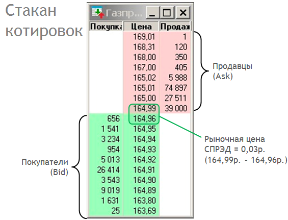
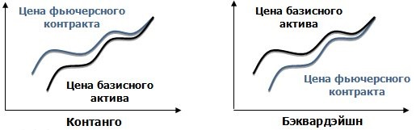
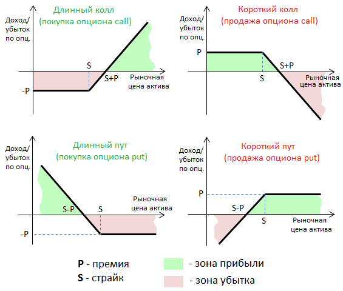

 

# ГАЙД ПО ТРЕЙДИНГУ И ИНВЕСТИРОВАНИЮ

Если в этом гайде что-то не понятно - пишите в тред, чтобы кто-нибудь дополнил или исправил.

## Чем биржа отличается от форекс?

Основное отличие в том что биржа не является контрагентом по сделкам и зарабатывает лишь на комиссиях, поэтому на бирже не возникает конфликта интересов. На форексе ты не видишь реальной цены и объема, а только то что показывает тебе терминал. В биржевом стакане, помимо реальных объёмов ты видишь заявки на покупку/продажу от всех покупателей и реальные рыночные спреды:

Кроме этого - на них торгуются разные инструменты. На форекс это синтетические валютные пары и CFD (Контракт на разницу цен). Об инструментах биржы читай ниже.

## Финансовые инструменты

Финансовыми инструментами являются ценные бумаги и валюты которыми можно торговать на рынках. Термины:

 - **Владелец** - лицо владеющее ценной бумагой
 - **Эмитент** - лицо выпустившие ценную бумагу
 - **Эмиссия** - процесс выпуска ценных бумаг

Финансовые инструменты могут быть базовыми, например [акции](#Акции-shares) и [облигации](#Облигации-bonds), так и производными (**деривативы**) - это [фьючерсы](#Фьючерсы-futures) и [опционы](#Опционы-options---не-путать-с-бинарными-опционами). Если ты ньюфаг или мусульманин - тебе не рекомендуется торговать деривативами.

### Акции (Shares)
Акция закрепляет права её владельца на получение части прибыли компании в виде дивидендов а также на управление компанией.
Управление компанией происходит путём голосования на собрании акционеров.

Акции могут быть обыкновенными или привилегированными. Привилегированные акции подразумевают только получение дивидендов но не управление.

#### Фонды ETF и ПИФы
Кроме акций обычных компаний, на биржах торгуются акции фондов, где стоимость акции определяется стоимостью имущества фонда поделённому на количество акций в обращении. Фонд может владеть как ценными бумагами, так сырьём и недвижимостью.

**ПИФ** - это паевой инвестиционный фонд, в котором паи/акции принадлежат пайщикам а имуществом фонда управляет назначенный управляющий или компания. Управляющий берёт себе фиксированную комиссию не зависимо от убытка/прибыли. Проблема ПИФов заключается в неполной прозрачности управления и высокая комиссия за управление, а также то что управляющий не всегда заинтересован в получении прибыли фондом. Поэтому последнее время ПИФы активно вытесняются фондами ETF.

**ETF** - это фонд, который содержит изначально задекларированные активы в заранее определённых пропорциях. То есть фонд может содержать только физическое золото или только акции из индекса S&P. График цены ETF повторяет цену зашитых в него активов. Управлять такими фондами проще, поэтому и комиссии за управление в них низкие. На американском рынке торгуется несколько сотен ETF фондов, при этом часто брокеры не берут комиссию за торговлю ETF. На российском рынке торгуется около 10 ETF фондов (на золото, облигации, индексы акций США, Германии, Японии, Британии, Австралии и другие), которые обслуживаются компанией [**Finex**](http://finxgroup.ru/), на их сайте смотри фонды и их состав.

### Облигации (Bonds)
Облигация - денежное обязательство эмитента облигации перед её владельцем. Проще говоря - кредит или долговая расписка. Облигация имеет **срок** выплаты, номинальную стоимость (**номинал**) - это основное тело долга, которое должен вернуть эмитент в конце срока, а также **купон** - это процент, который выплачивается дополнительно к телу долга. Купон выплачивается раз в год/квартал/месяц. Срок облигации может быть как 1 год так и 2, 3, 5, 10 лет. На протяжении всего срока жизни облигации владелец может продавать и покупать облигацию по свободной рыночной цене. Цена облигации пишется в процентах от номинала: например, цена 95 от олигации номиналом 1000 рублей означает 950 рублей. Виды облигаций:

 - **Государственные (казначейские) облигации** - облигации выпускаемые от имени правительства. К ним относятся российские **ОФЗ** - облигации федерального займа
 - **Муниципальные облигации** - облигации выпускаемые от имени местных органов власти
 - **Корпоративные облигации** - выпущены от имени частных компаний, например облигации "Трансаэро"

Облигации различаются по валюте в которой они номинированы. Например это рублёвые облигации выпущенные и продаваемые на российском рынке, или **евробонды** - облигации российских эмитентов, номинированные в иностранных валютах (USD, EUR, CHF). Евробонды до недавнего времени торговались приимущественно на евро**пейс**ком рыночке и большими лотами по 100K денег. Сейчас есть возможность приобретать дробные лоты на нашем рынке.

По виду дохода облигации могут быть **дисконтные**, **купонные** и с **плавающией процентной ставкой**. Внимательно читай описание облигаций которые приобретаешь.

Облигации традиционно считаются самыми надёжными влошениями, но они тоже имеют свои риски:

 - проблемы у эмитента - в этом случае эмитент будет клясться мамой что отдаст деньги попозже. Этот риск плавно перетекает в следующий
 - банкротство эмитента - в этом случае вы скорее всего ничего не получите и потеряете 100% влошений
 - валютный риск - если ЦБ страны изменит ключевую процентную ставку, то на рынке появятся облигации с более выгодным купоном, а ваша облигация подешевеет на разницу процентных ставок умноженную на время до конца срока облигации (лет)
 - валютный риск 2 - если происходит девальвация валюты в которой номинирована облигация (в случае если ставка облигации не привязана к инфляции)

### Фьючерсы (Futures)

Фьючерс - это контрактное обязательство эмитента (продавца фьючерса) поставить некий **базовый актив** в будущем, к определённой дате - **дате экспирации**. Базовым активом может быть как сырьё (нефть, кукуруза, говно), так и акции (фьючерсы на акции газпрома) и валюты (фьючерс на доллар - **Si**). 

Цена фьючерса не всегда равна цене базового актива, т.к. если рыночек ждёт изменения цены **БА**, то на этих ожиданиях может расти или падать цена на фьючерс. Разница между ценами БА и фьючерса называется **контанго/бэквардация**. Чем ближе дата экспирации фьючерса, тем эта разница меньше, т.к. тем меньше вероятность что цена БА изменится.

Фьючерсы бывают:

 - поставочные - при экспирации которых на биржу поставляется реальный актив
 - расчётные - при экспирации которых поставлется денежный эквивалент базового актива

Читайте спецификацию фьючерсных контрактов если не хотите на экспирации получить вместо денег - бочки с соляркой или валюту/акции на счёт.

**Клиринг**: При покупке фьючерса биржа блокорует **гарантийное обеспечение** (**ГО**) на вашем счёте. ГО составляет 5-15% от цены. Ежедневно у покупателя и продавца начисляется/списывается вариационная маржа, равная изменению рыночной цены фьючерса. Т.е. если купленный вами фьючерс подорожал за день на 150 рублей, то на ваш счёт будет начислено 150 рублей. Окончательные расчёты производятся на дату экспирации. Если фьючерс поставочный, то к дате экспирации вам нужно иметь на счету средств/ценных бумаг достаточно для исполнения обязательств по контракту.

### Опционы (Options) - не путать с бинарными(!) опционами

Контракты, дающие возможность к определённому сроку в будущем купить/продать **базовый актив** по заранее оговорённой цене (**страйк**). Вы платите рыночную премию за опцион, и если цена БА изменилась вам может быть выгодно использовать свой опцион. Опционы могут быть как на покупку (**call**) так и на продажу (**put**). При этом вы можете как продавать так и покупать оба вида опционов.

Для покупателя, опцион - это своего рода страховка от подорожания (или удешевления) **БА**. Продавец же опциона несёт больше рисков, так как он обязан продать/купить БА (по требованию покупателя) к сроку экспирации независимо от того - на сколько изменилась цена БА. Поэтому **продажей** опционов занимаются только профессионалы ~~и инсайдеры~~.

Опционы бывают:

 - поставочные - при экспирации которых на биржу поставляется реальный актив
 - расчётные - при экспирации которых поставлется денежный эквивалент базового актива

В зависимости от биржи опционы могут быть с автоматическим или ручным исполнением. Также бывают **американские** и **европейские** опционы: американский опцион может быть погашен в любой день до истечения срока опциона, европейский опцион может быть погашен только в указанную дату.

**Клиринг**: Покупатель платит премию за опцион, а у продавца биржа блокирует **гарантийное обеспечение** (**ГО**). Ежедневно у покупателя и продавца начисляется/списывается вариационная маржа, равная изменению рыночной цены опциона. Окончательные расчёты производятся на дату экспирации. К дате экспирации вам нужно иметь на счету средств/ценных бумаг достаточно для исполнения обязательств по контракту. Будьте внимательны, т.к. базовым активом, кроме сырья, акций и валюты могут быть фьючерсы.

#### Альтернативное пояснение за опционы:

     - например тебе нужна купить травки ко дня рождения, и ты боишся что она подорожает из за инфляции. Диллер ставит анус что он тебе в день рождения продавт её по определённой цене, которую вы фиксируете сразу. Это и есть опцион за который ты платишь диллеру какую-то цену(т.к. он несёт риски). Ты можешь и не воспользоваться опционом если вдруг на день рождения друзья притащили метамфитамин
    
     - Получается в день рождения деньги уплаченные дилеру сгорят, если я не продам опцион тому, кому не так повезло с друзьями? А если никто не захочет купить травы? Или взаиморасчеты с дилером пройдут по текущей цене опциона?
    
     - если не продашь - то сгорит опцион в день экспирации, считай это была твоя страховка
    но если ты можешь выкупить траву и продать её сразу дороже, то можешь провернуть это в день экспирации и получить прибыль
    
     - Спасибо, все понятно.
    Открываешь, допустим, лонг по базовому активу и покупаешь путы для страховки. Или шорт и коллы. Так это работает?
    
     - если ты покупаешь базовый актив и хочешь ограничить обытки купив пут, тебе рациональнее будет купить опцион кол
    
     - А что выгоднее, выкупить и продать траву или продать опцион?
    
     - одинаково
    
     - Но если ба будет падать, то колл будет падать, а пут расти, разве нет?
    
     - если ба будет падать, а пут рости
    то у тебя будет убыток по БА и профит по PUT, в сумме 0 минус затраты на опцион
    если кпишь просто кол, и БА при это будет падать, то ты просто потратился на опцион
    
     - вобщем купить БА или фьючерс, то же самое что купить кол и продать пут (это синтетический фьючерс)
    при продаже опциона ты выступаешь в качестве диллера и несёш риски лишиться ануса
    в обычных опционах ты ставишь не на рост, а на достижение определённой цены (страйка). в прибыль тебе идёт движение которое ушло дальше страйка, чем дальше за страйк ушло - тем больше получишь
    на ММВБ сейчас вроде правило, что опционы исполняются автоматом, поэтому на день экспирации нужно иметь достаточно денег чтобы выкупить БА (в случае фьючерсов нужно иметь ГО фьючерса)

#### ...или такой вариант:

     - Это, блять, то же самое, что на рынке нагнуться рубль поднять и надеяться, что тебя Ашот в это время в жопу не выебет.
    
     - Вот для таких случаев и существует балансировка портфеля. Можно выбросить из кармана 50 копеек монетой, можно ашоту предложить вазелин, можно выкинуть обратно рубль. Все от фантазии зависит, лол
    
     - Но ведь лучше самому кидать рубль, не? Убыток твой рубль, а отъебать можешь мамкиного сыча, ашота, еот, даже небо, даже аллаха.
    
     - Как нм крути это палка с двумя концами. Тот же Ашот подберёт твой рубль, а потом на черной свечке придет Рулон Обоев и ты сам ему еще три рубля отдашь. А тренд продолжит движение, но уже без тебя
    
     - Ну это уже к вопросу о мм. Я рубль проебу и пойду думать, куда бы еще рубль кинуть, раз Ашот такой хитрый

## Биржа

Организация которая сводит вместе покупателей и продавцов, производит эмиссию ценных бумаг и обеспечивает расчёты по сделкам. Вот примеры некоторых бирж:

 - [**ММВБ**](http://moex.com/) - Московская Биржа
 - [**NYSE**](http://www.nyse.com) - Нью-Йоркская фондовая биржа
 - [**LSE**](http://www.londonstockexchange.com) - London Stock Exchange

### ММВБ a.k.a MOEX

Московская биржа, имеет следующие секции:

 - Фондовый рынок - рынок где происходит обращение акций и облигаций
 - Рынок Фортс (FORTS) - рынок где ведётся торговля фьючерсами и опционами
 - Валютный рынок - секция для покупки/продажи валюты

## Брокеры

Торговля на бирже осуществляется через компании-брокеры. В них клиенты открывают брокерские счета и управляют сделками. В России брокеры также являются налоговыми агентами и уплачивают налоги вычитая их из доходов клиентов (кроме валютной секции).

Крупнейшие дисконтные (т.е. не дорогие) американские брокеры, это [**Interactive Brockers**](http://www.interactivebrokers.com) и [**Ameritrade**](http://www.amtd.com/). Последний приостановил открытие счетов для клиентов из России.

Крупнейшие Российские брокеры это [**Открытие**](http://open-broker.ru/), [**БКС**](http://bcs.ru/) и [**Финам**](http://www.finam.ru/). Также есть брокеры от банков, такие как [Тиньков](https://www.tinkoff.ru/invest/), [Альфабанк](https://www.alfadirect.ru/), [Сбербанк](http://www.sberbank.ru/ru/person/investments/broker_service/marketsandservices). Более полный список брокеров тут http://stocks.investfunds.ru/brokers/ratings/ . Выбирай понравившиеся тарифы и условия. Открыть счёт у некоторых брокеров можно удалённо, используя аккаунт на "[Госуслугах](https://www.gosuslugi.ru/)".

> У тинькова конские комиссии и урезанный функционал. У открытия самые дешёвые тарифы.

Деньги на счетах российских брокеров не подпадают под систему страхования вкладов. Поэтому если брокер обанкротится - вы можете потерять все средства. С другой стороны, если у вас куплены акции/облигации - то теоретически, они будут храниться в депозитарии и даже в случае банкротства брокера по прежнему будут зарегистрированы на вас (помните, что в режиме т2 на ммвб бумаги попадают в депозитарий через 2 дня после покупки).

Торговля может осуществляться разными способами:

 - через терминал для компьютера, обычно это **Quik**, **MT5** или свой терминал
 
 - через приложение для смартфона, обычно это **Quik** или **MT5**
 
 - через вэбсайт брокера - **Webquik** или Тиньков
 
 - поручения голосом по телефону

### Индивидуальный инвестиционный счёт (ИИС)

Для популяризации инвестирования среди населения - в российской практике введён особый тип инвестиционного счёта, по которому можно получить налоговый вычет 13% на вносимые средства. Клиент сам выбирает будет ли этот вычет производится из НДФЛ, уплаченного по основному месту работы или из дохода, полученного на ИИС. ИИС имеет ограничения:

 - у одного человека может быть только один ИИС
 - максимальная сумма вносимых средств - 400к рублей в год
 - счёт должен существовать минимум 3 года, в течении которых нельзя выводить средства - иначе, вычет придётся вернуть

**Плюс ИИС**: налоговый вычет.

**Минус ИИС**: необходимость держать деньги не снимая 3 года.

**Лайфхак**: Да, в теории можно открыть счёт не кладя на него деньги, подождать 2 года и 364 дня, положить 400 тыс и через пару дней их снять, получив вычет 52к.

## Интернет ресурсы

 - http://moex.com/ - официальный сайт московской биржи
 - http://investing.com/ - КОТировки
 - http://www.rusbonds.ru/ - облигации с отбором по параметрам
 - http://ru.cbonds.info/ - облигации с отбором по параметрам
 - http://www.dohod.ru/ik/analytics/dividend/ - информация по дивидендам
 - http://quote.rbc.ru/exchanges/demo/micex.0/intraday - список акций ммвб с удобной сортировкой по параметрам
 - http://www.option.ru/analysis/option - анализ опционов
 - http://mfd.ru - КОТировки, АНАЛитика, форум
 - http://smart-lab.ru - шквар-лаб
 - http://www.finanz.ru/ - новости, статьи
 - http://investcafe.ru/ - идеи, статьи
 - https://ru.insider.pro - новости, статьи
 - http://expert.ru/ - новости, статьи
 - https://vk.com/alenkacapital , http://alenkacapital.com/ - инвест-идеи

## Литература и темы которые полезно знать

### Макроэкономика
* книга 1
* торрент 1
* книга 2
* книга 3

### Микроэкономика
* книга 1
* торрент 1
* книга 2
* книга 3

### Ценные бумаги
* книга 1
* торрент 1
* книга 2
* книга 3

### Теория игр
* цацаоцоа
* оарыолварыв
* ываывола

